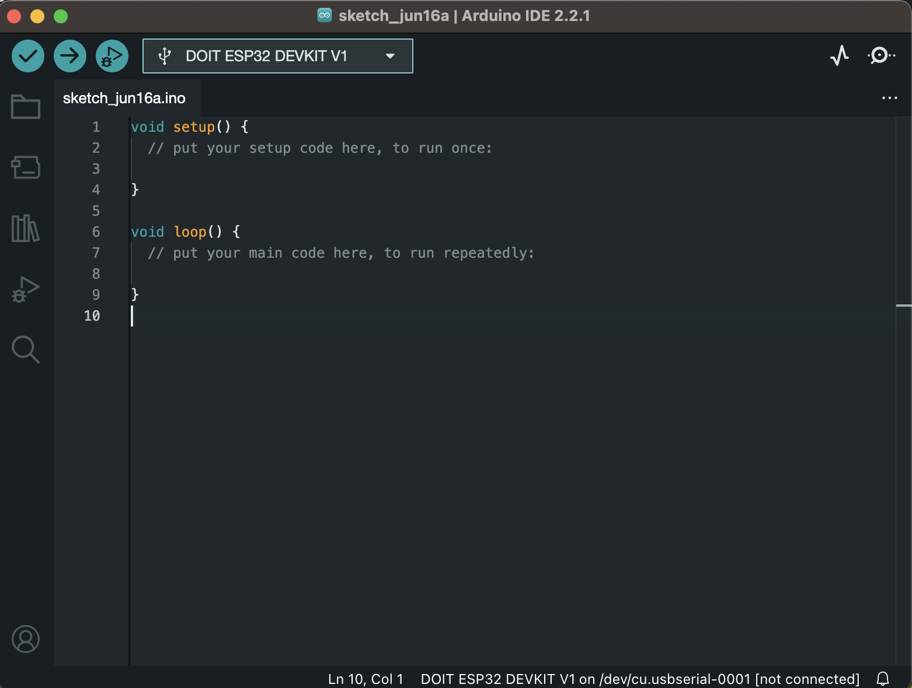
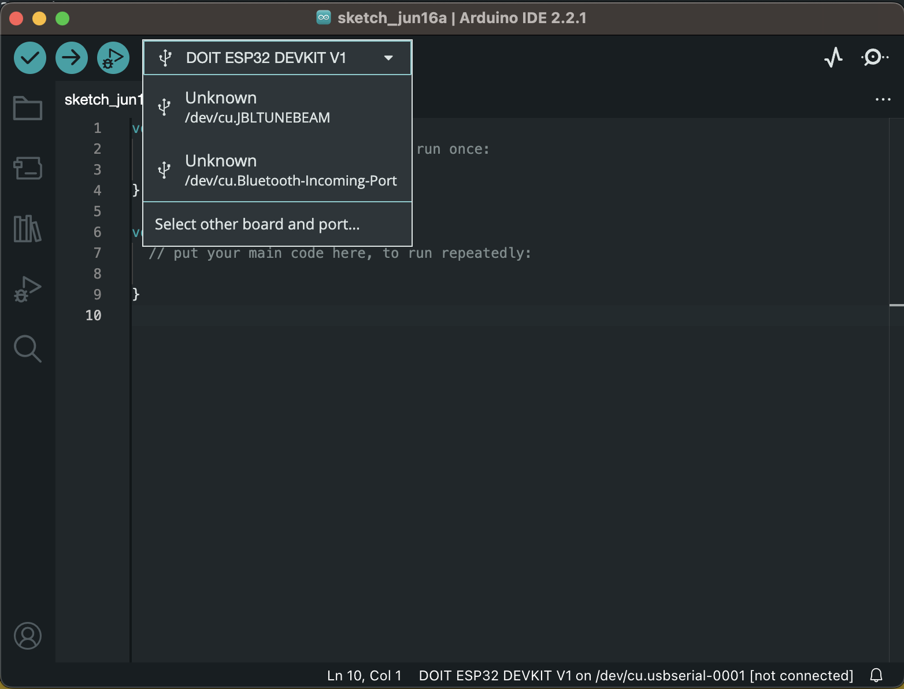
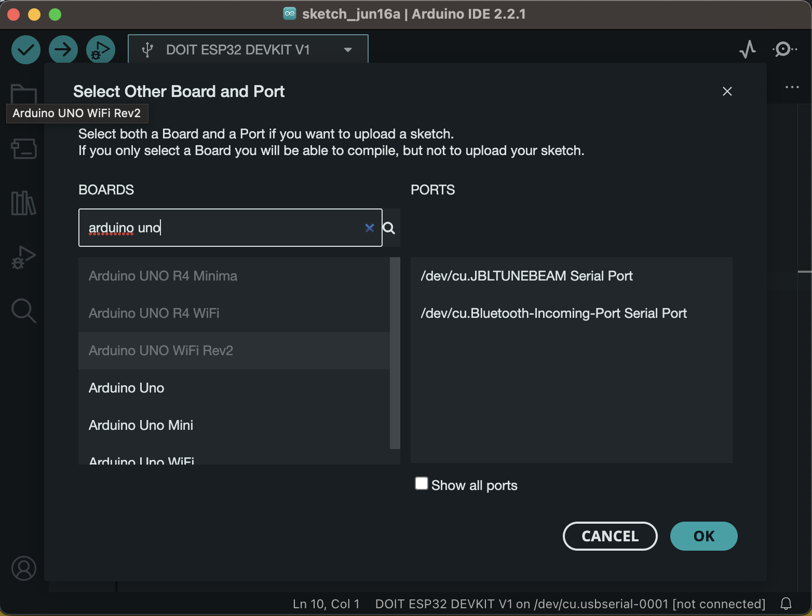

# Arduino & Arduino IDE

---

If you haven't already [download the Arduino IDE 2.x here](https://www.arduino.cc/en/software).

We will do all programming in the IDE as it will take over the task of compiling and flashing the code on the board for us. Convenient!

---

---

