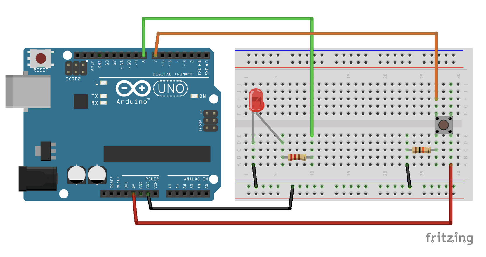

# Circuit 1.4: Programmed Button

---

Let's add the button back to the mix.

This time we will read the button state via the Arduino and then use it to make the LED light up.

---

Change the circuit to this:



---

This is the code:

``` c
int led_pin = 3;
int button_pin = 4;
bool button_state = false;

void setup() {
  pinMode(led_pin, OUTPUT);
  pinMode(button_pin, INPUT);
}

void loop() {
  button_state = digitalRead(button_pin);
  digitalWrite(led_pin, button_state);
}
```

## Pulldown resistor

Why does the button need a resistor? Good question!

- When the button is in an open state it there is no defined value on its pin but the Arduino will still try to read it

- In this case the open button behaves like an antenna and catches electrical charge around it (Sometimes that's what you want, see [EMF/Ghost detector](https://www.youtube.com/watch?v=hd1QjvQae-Q))

- Try removing the resistor and look at the difference!

- The Arduino comes with an internal resistor for this exact case, search for `pinMode(pin, INPUT_PULLUP)`
