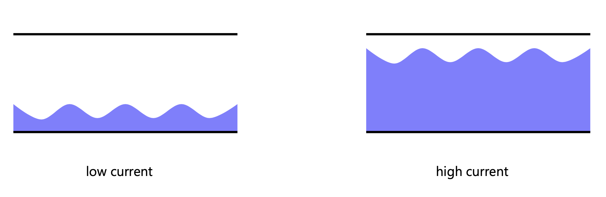
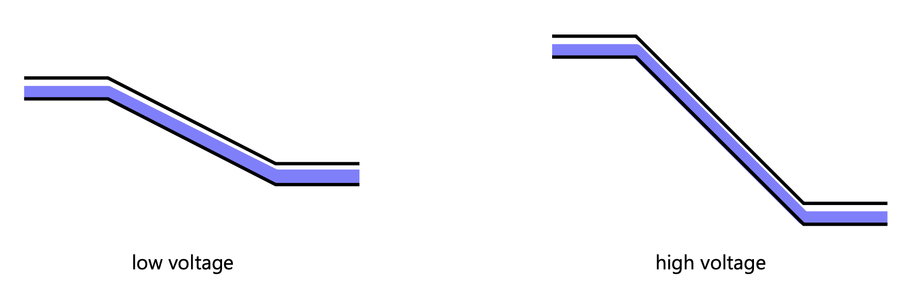
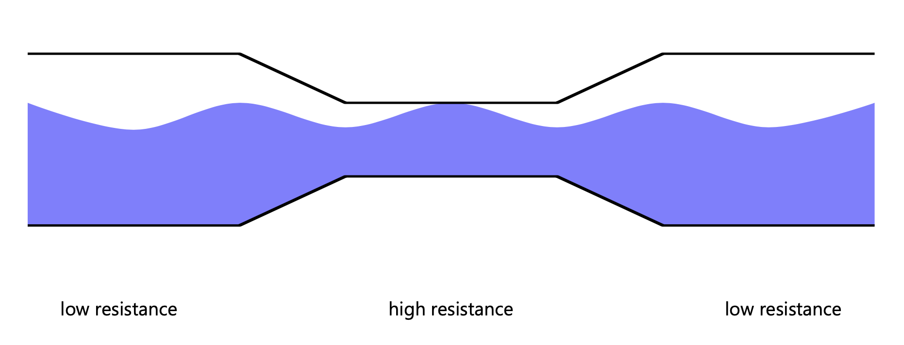
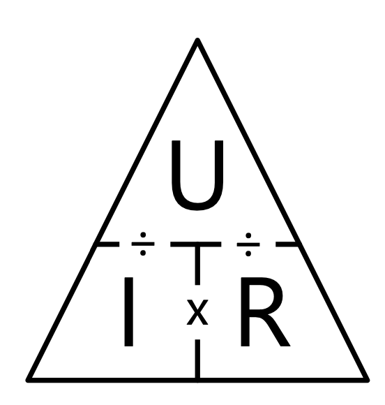

# Electricity & Circuits

---

Since we'll get in touch with the physical world, we need to learn about some physical properties of the world, and how they relate to each other.

With this knowledge we can start working on circuits, which I sometimes think of as programming in hardware.

After that we can start reading values from our circuit via a microcontroller.

# Electricity

## Electrical charge

|Symbol|Unit|
|--|--|
|Q| Coulomb (C) or Ampere Second (As)|

- Physical property on which all electricity is based

- Bound to matter, needs a charge carrier (e.g. electrons)

- Positive, negative, neutral charge

- Different charges attract, similiar charges retract

## Electrical current

|Symbol|Unit|
|--|--|
|I| Ampere (A)|

- Result of moving charge carriers

- The more charged particles move between conductors, the more current flows

## Electrical voltage

|Symbol|Unit|
|--|--|
|U| Volt (V)|

- Causes the movement of charge carriers

- Difference of potential

## Electrical resistance

|Symbol|Unit|
|--|--|
|R| Ohm (Ω)|

- Caused by obstruction of charge carriers in conductors

- Converts electrical energy into heat

## Capacitance

|Symbol|Unit|
|--|--|
|C| Farad (F) |

- Ability to store electric charge

- Measured as `charge / voltage`

## Electrical power

|Symbol|Unit|
|--|--|
|P| Watt (W)|

- Amount of energy per time unit t

- W = I x U

## Water model

---

---

---

## Measuring

We measure **current** flowing through **one point**.

We meassure **voltage** between **two points**.

# Ohm's Law

- Describes the relationship between voltage, current and resistance

# Kirchoff's Law

## Current Law

- The sum of all current flowing into and out of a joint is 0

- What goes in goes out (like in a crossing of water pipes)

- Current that flows in has a positive sign, current that flow out has a negative sign

## Voltage Law

- The sum of all voltages in a loop is 0

- Is a consequence of the rule of "conservation of energy" (energy can not be created neither disappear in closed system)

## Consequences

In a **parallel circuit** voltage (U) stays the same, currents need to be summed up

In a **serial circuit** current (I) stays the same, voltages need to be summed up

# Good news

In the beginning, you don't really have to care about these things too much.

It will only become relevant once you start building larger, more complex circuits, and then you can find the formulas and plenty of other resources online.
