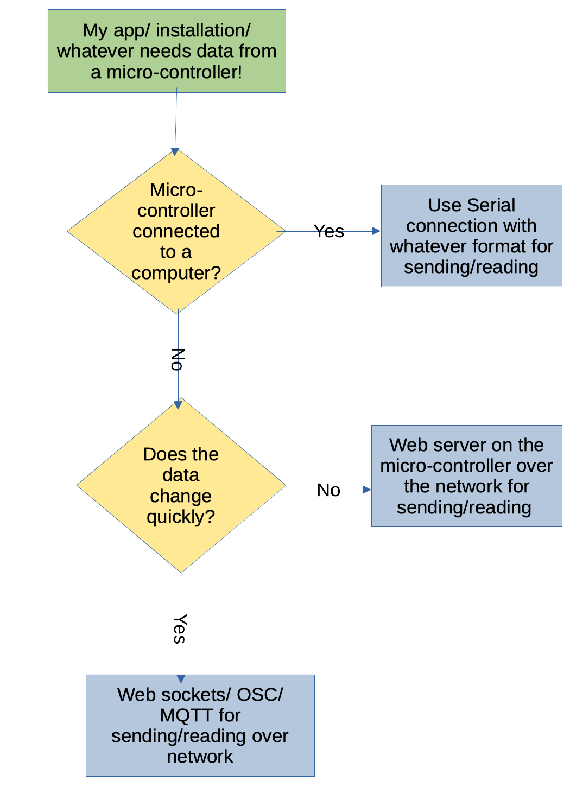

# Webserver

One cool feature is that the ESP32 can be used as a small webserver, exposing the data it's dealing with directly to a web interface (in the same network ((or as its own access point)).

This can be useful for configuring your setup without having to connect to the controller directly, or interacting with your piece remotely.

---

Let's build the LED ciruit first!

- 2 LEDs
- 2 330 Ohm resistors
- cables and a breadboard

---

Next we need code to connect the ESP to our local network.

[Copy or download the code from here!](https://github.com/lislis/workshop-intro-physical-computing/blob/main/code/esp32/esp32-webserver/esp32-webserver.ino)

---

We'll walk through it!

It's useful to understand:

- Client-Server architecture

- Basic TCP/IP

- HTTP as a protocol and markup language

---

Try out your app!

---

Instead of displaying the info on an HTML page, we can write it as JSON or just plain text.

[Here is a stripped down version of the sketch above](https://github.com/lislis/workshop-intro-physical-computing/blob/main/code/esp32/esp32_webserver_txt/esp32_webserver_txt.ino) that just returns a plain text string.

Of course everything is a bit nicer with JSON! The popular [Arduino_JSON](https://github.com/arduino-libraries/Arduino_JSON) has you covered! I leave it as an exercise to interested readers to install this library and look through the examples.

---

Strictly, there is no need for HTTP. Do whatever you feel comfortable with or what gets your project up and running the fastest!

Usually these questions will get to which approach to use:

- "Just" reading data? Or also sending data?

- How fast does the data change? Is polling/ requesting enough? Do we need to send out constantly?

I made a handy flowchart for my own personal opinion on when to use what.

---

---
