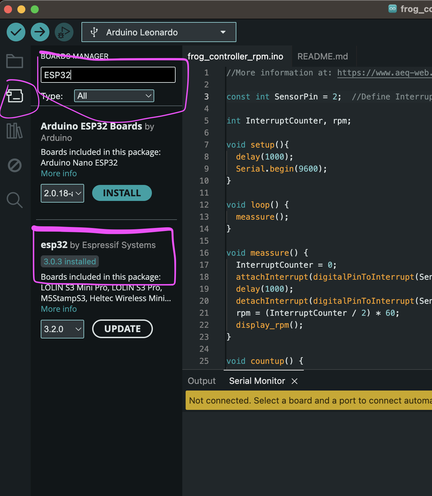

# ESP 32

A popular micro-controller and follow-up model of the ESP8266, is the ESP32.

The ESP8266 was the first affordable micro-controller with on-board wifi-chip and networking stack, kind of said to have kick-started the IoT-era.

The ESP32 is bascially the same but faster, more powerful, with Bluetooth and more pins. The total package!


## Pinout


---

Some things to note are:

- everything is 3.3V (no 5V available)

- all pins are PWM

- pins marked as **ADC** are analog-digital-converters, **DAC** are digital-analog-converters

- pins marked at **touch** have build-in capacitive sensing


## Adding ESP to the IDE



---

Uploading a hello-world-sketch!

``` cpp

#define LED 2

void setup() {
  Serial.begin(115200);
  pinMode(LED, OUTPUT);
}

void loop() {
  digitalWrite(LED, HIGH);
  Serial.println("LED is on");
  delay(1000);
  digitalWrite(LED, LOW);
  Serial.println("LED is off");
  delay(1000);
}

```

---

Note that some ESP32 development boards **don’t go into flashing/uploading mode automatically** when uploading a new code and you’ll see a lot of dots on the debugging window followed by an error message. If that’s the case, you need to **press the ESP32 BOOT button** when you start seeing the dots on the debugging window.

---

We're ready to go!
