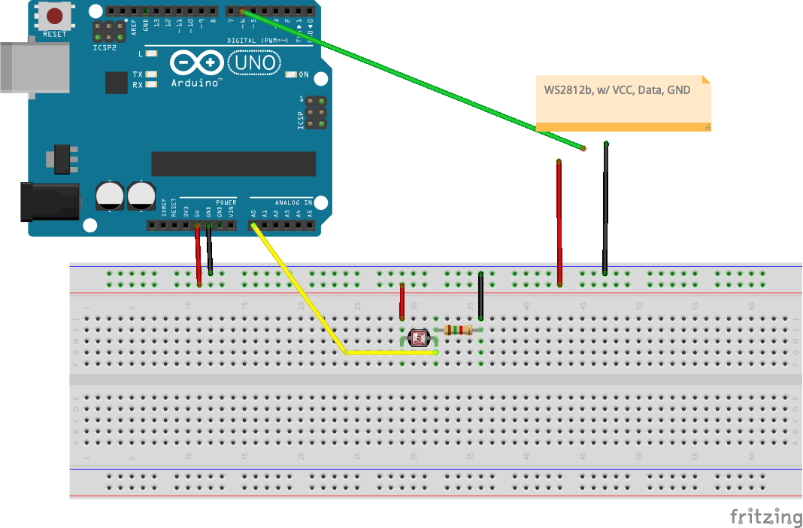

# [Circuit] Photoresistor and led stripe

Let's combine input and output!

Wire up a photoresistor and LED stripe like in the diagram. You also need one resitor of at least 1k.




Use and adjust the code. In the example the reading from the resistor is used in mboth the brightness and the color of the LEDs. But you can make your own rules!

How about until a threshold is reached, only the even numbered LEDs light up. And above the threshold only the odd numbers?


``` c++
#include <Adafruit_NeoPixel.h>

#define PIN 6
#define NUMPIXELS 30
Adafruit_NeoPixel pixels(NUMPIXELS, PIN, NEO_GRB + NEO_KHZ800);

const int photoresistor = A0;

void setup() {
  pixels.begin();
  Serial.begin(9600);
  pinMode(photoresistor, INPUT);
}

void loop() {
  int reading = analogRead(photoresistor);
  Serial.print(reading);
  Serial.print(" ");

  // mapping based on my current readings, please adjust accordingly!
  int brightness = map(reading, 800, 1010, 50, 180);
  Serial.println(brightness);

  pixels.clear();
  pixels.setBrightness(brightness);

  for(int i=0; i<NUMPIXELS; i++) {
    pixels.setPixelColor(i, pixels.Color(brightness, 0, 250 - brightness));
  }
  pixels.show();
  delay(200);
}

```
