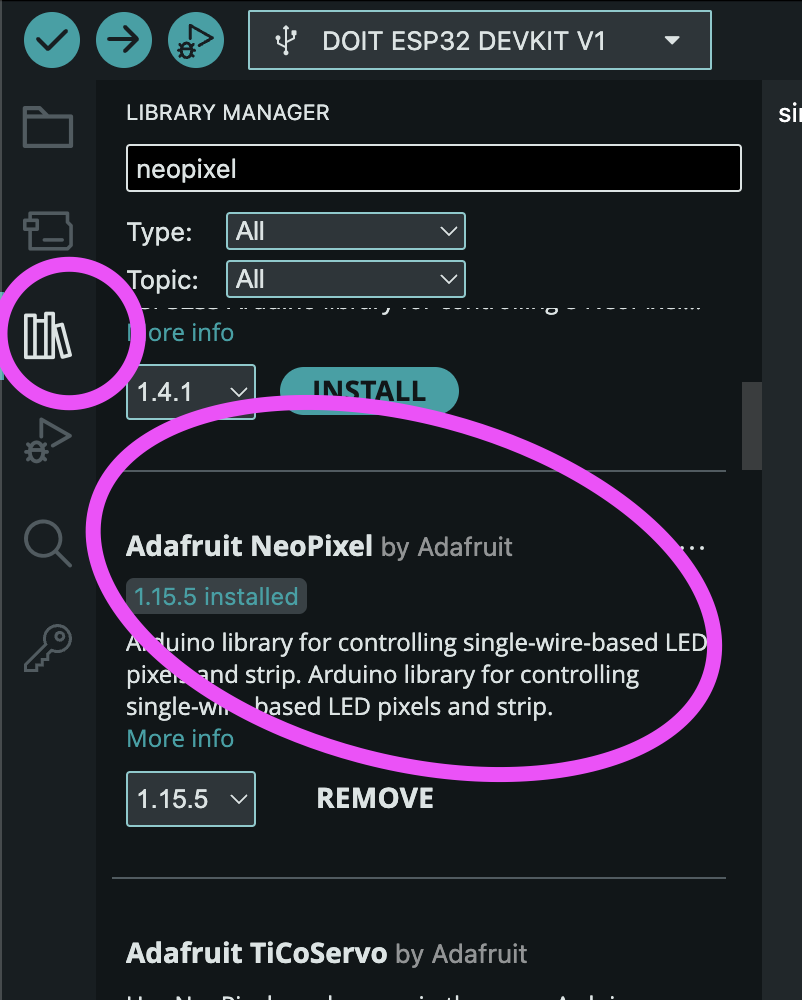

# LED stripes

There's a variety of LED stripes out there, but the company Adafruit made a special one called the Neopixel where we can control every pixel individually! Nice!

Original Neopixels are fairly expensive but there are a bunch that are compatible with the [original library from Adafruit](https://github.com/adafruit/Adafruit_NeoPixel) like the WS2812b.

The stripes come in various "densities", as in, how many pixels per 30cm strip. While very dense pixels might look cool, I'd usually prefer ones with a little more spacing, so we can cut and solder custom lengths.

Cut and solder? Yes! The stripes usually expose their connections and you can just cut them with wire clippers and solder them back together, or extend them with cables or whatever you need to do. Just make sure the direction stays the same! The GND, VCC and data connectors have to match!

## Install the library

In the Arduino IDE, click on the library manager on the left and search for "neopixel". The "Adafruit Neopixel by Adafruit" is what we want. There are different others available, too. For for us the simple one is enough.

## Open the simple example

Under `File > Examples > Adafruit Neopixel > ` open the `simple` example. To connect you just have to connect VCC, GND and one data pin (adjust on line 10).

Adjust the number of LEDs you want to light up (NUMPIXELS on line 14). And then try to run the code!

There specified number of pixels should light up in one color. Look at the code in the `loop`.

It's very similar to working with canvases in P5.js. `Clear` the pixels, set a color in RGB and call `show` to actually send the color data to the stripe!
