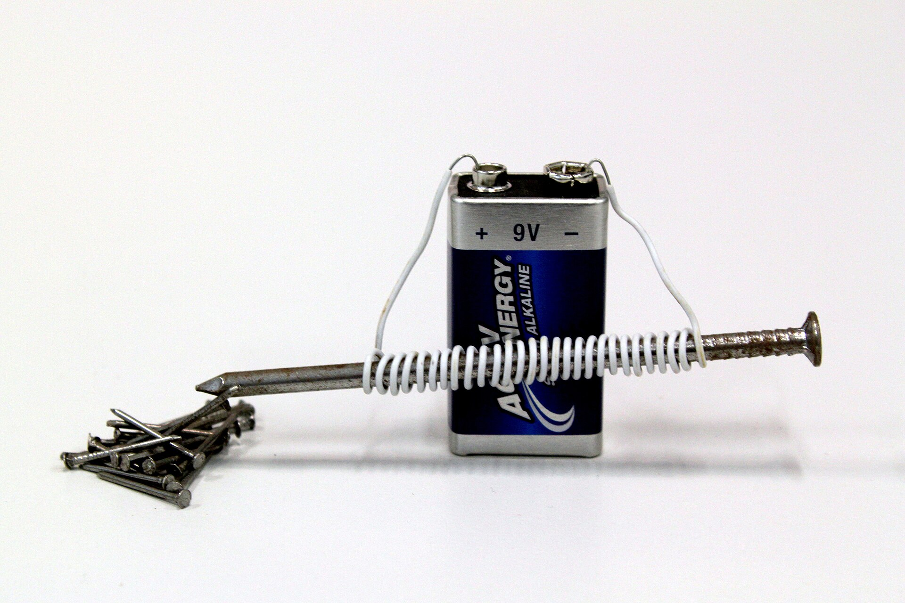

# Electro-magentism

Another fun property of electricity: magentism!

---

If you send electricity through a conductive cable, it naturally becomes a tiny bit magnetic.

You wouldn't notice though, the effect is very weak.

To enhance it and make the magnet usable, we wind the cable around a metal (usually iron) core (aka a coil).

And boom: electro-magnet!

---

---

I'm not going into details about electromagnetism here, but feel free to [read up on it](https://en.wikipedia.org/wiki/Electromagnet).

Electromagnets are used in various applications. We'll see them being used in motors.
