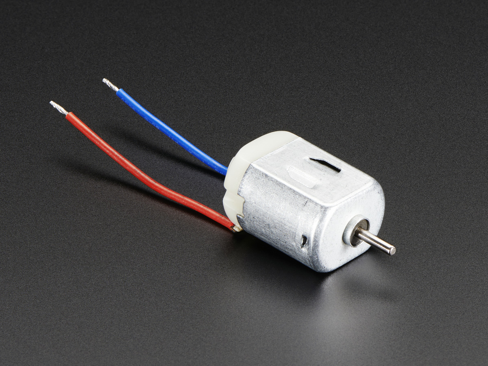

# Motors

There are various kinds of motors out there. We'll start simple and work towards more complex.

## DC-motors

DC-motors are the simplest motor.

The name comes from the  DC current (the one we've been using in our circuits the whole time).

---

Internally they're basically an electromagnet that rotates a shaft through alternating between magnetic poles.

---

The DC-motor doesn't care about direction of current.

It does however effect the direction of the rotation!

---

DC-motors usually run on a high voltage.

3.3V should be enough to get a small one to rotate, but less probably not.

The higher the voltage the faster your motor is rotating.

---

Most of the time you'll have a 9V or 12V motor doing some heavy-lifting. For this you'd need a different circuit with a stronger power supply, but sharing the same ground as the rest. And a motor driver (or T-bridge) but this is out of the scope for this workshop.

But it's also not super hard, just search for it.

---

The fun part with DC-motors start when you attach cogs and wheels to get different kinds of mechanical motion.

Which brings us to Servo-motors.
