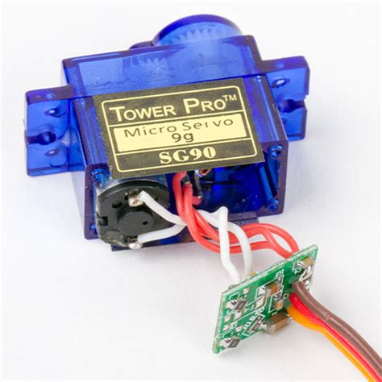

# Servo motors

Servos are small motors where you can control the angle of the rotation.

---

In the DC-motor we didn't have control over the rotation, we could just turn it on and off.

A servo comes with an IC and some mechanical parts that translate a PWM-signal into a rotational angle. Pretty nifty!

Most servos can only rotate on a 180 degree angle however. (There are also 360 degree ones now, but that's not the standard).

---

---

---

The servo has three pins, GND (brown), VCC (red) and the data pin (yellow-ish).

A circuit is pretty simple then, connect the power and `analogWrite()` to the data pin!

---

The Arduino IDE comes with a Servo library preinstalled. We can use it and conveniently give the servo an angle to rotate to instead of interpolating ourselves.

Look at the example at

**File > Examples > Servo > Sweep**

---

Here is a cool project by former CTechies using a bunch of servos

https://vimeo.com/718211161
