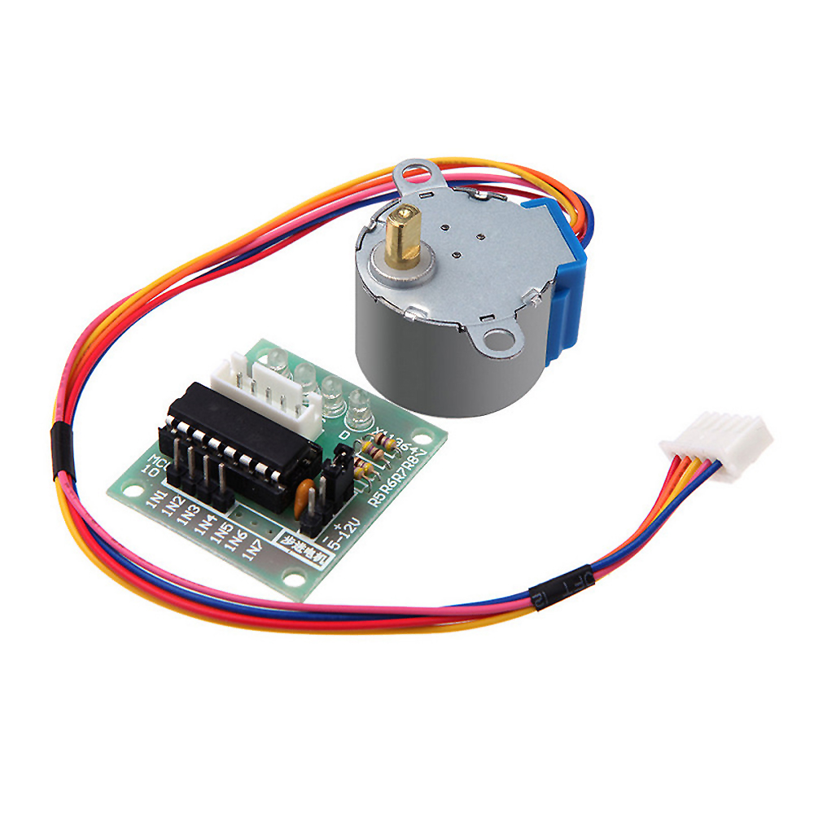
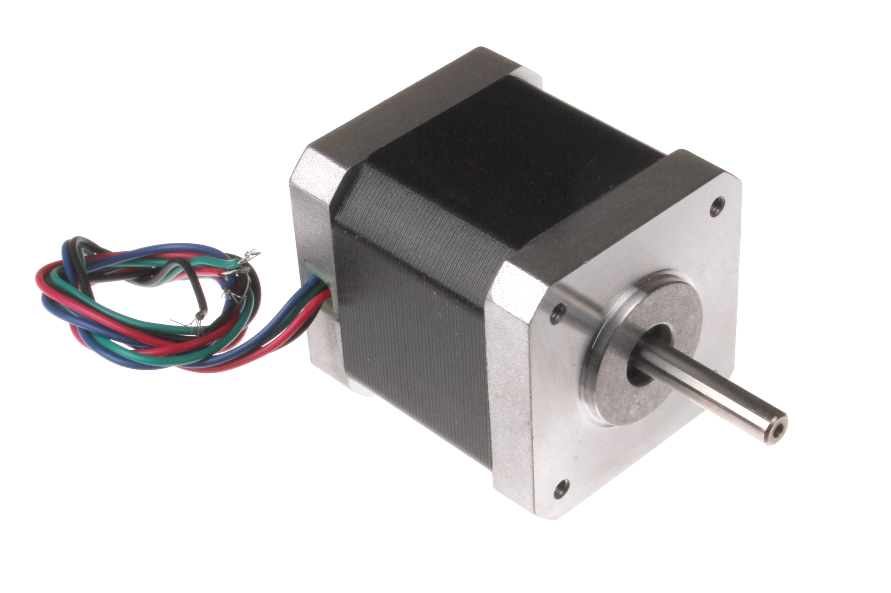

# Stepper motors

---

Steppers give you ultimate control over how many "steps" the motor rotates into one or the other direction.

How many steps a given motor can do is noted in its data sheet.

---

Steppers are used in pen plotters, 3D printers and generally where you have to move precisely on an axis.

---

---

---

Wiring and controlling a stepper is a tiny bit more advanced and we're running out of time.

That's why we leave it at that.

As usual though, the internet is your fiend.
