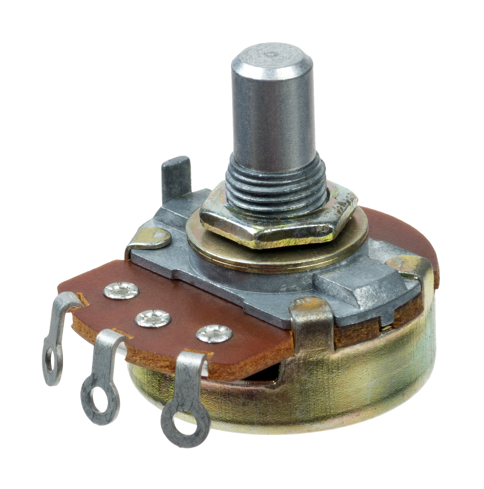

# Analog values

We read analog values (like resistance or capacitance) via the analog pins!

---

Classic controls such as potentiometers and faders change their resistance base on their rotation or position.

Instead of using it for purposes strictly for the circuit, we can read the change and map it to something else.

---

Common analog "sensors" are photoresistors (measure direct light), rain or soil moisture sensors.

---

It's pretty straight forward, and basically you already know everything.

---



Potis don't care about the direction of current.

They usually have three legs, the outer ones for GND and VCC, the middle one for reading.

---

``` c++
void setup() {
    Serial.begin(9600);
    pinMode(A0, INPUT);
}

void loop() {
  # analogRead gives us values between 0 and 1023
  int reading = analogRead(A0);
  Serial.println(reading);
}
```

Change the VCC from 5V to 3.3V. What do you notice?
