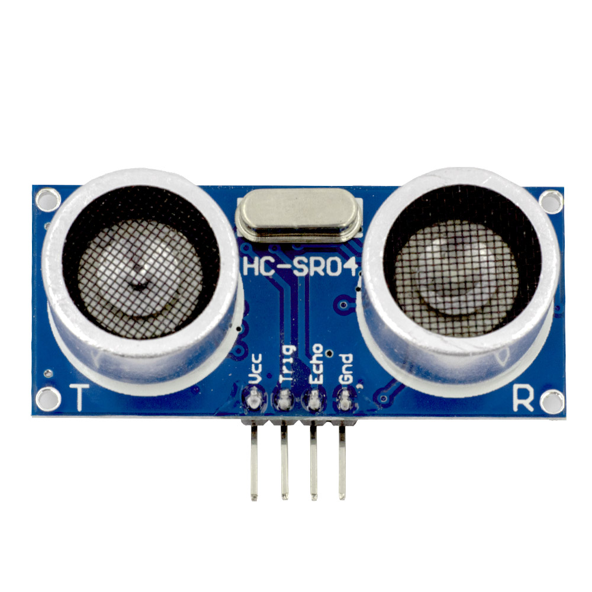

# [Circuit 2.1] Ultrasonic distance sensor

A popular beginner sensor is the ultrasonic distance sensor HC-SR04.

Ultrasound! Like bats and dolphins!

---



Note the pin labeling, easy!

---

``` c++
const int trigPin = 5;
const int echoPin = 18;

#define SOUND_SPEED 0.034

long duration;
float distance;

void setup() {
  Serial.begin(9600);

  pinMode(trigPin, OUTPUT);
  pinMode(echoPin, INPUT);
}

void loop() {
    digitalWrite(trigPin, LOW);
    delayMicroseconds(2);
    digitalWrite(trigPin, HIGH);
    delayMicroseconds(10);
    digitalWrite(trigPin, LOW);

    duration = pulseIn(echoPin, HIGH);
    distance = duration * SOUND_SPEED/2;

    Serial.println(distance);

    delay(50);
}
```

Read about [pulseIn](https://reference.arduino.cc/reference/cs/language/functions/advanced-io/pulsein/).
