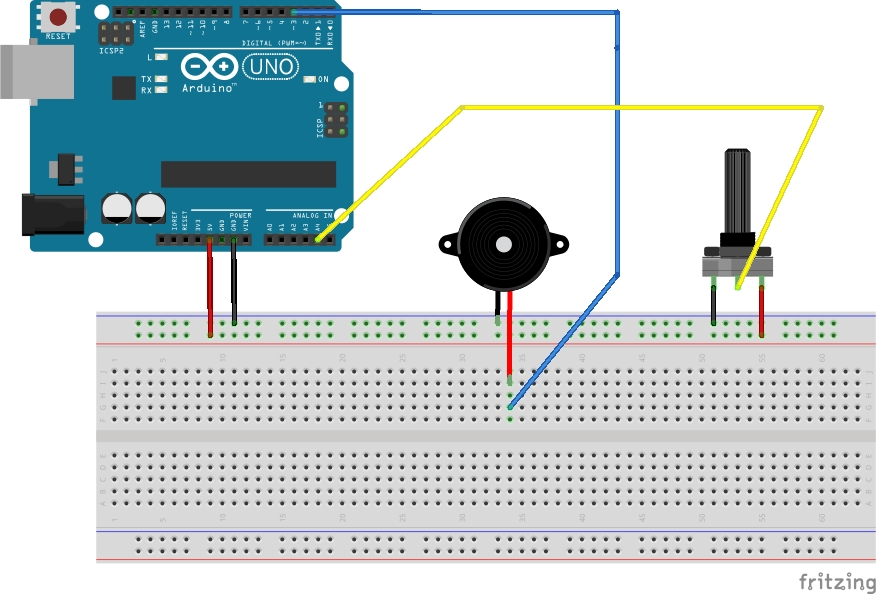

# [Circuit 2.1] Beep boop

In this exercise we'll start mapping an analog input to our first actuator, a [piezzo buzzer](https://en.wikipedia.org/wiki/Piezoelectric_speaker)!

It's a speaker in its simplest form, just a membrane that vibrates when it receives an electic current.

This will make a lot of annoying sounds. Sorry about it! But it's also fun :D

---



---

``` c++

const int poti = A4;
const int buzzer = 3; // this has to be a PWM pin!

int reading, mapping;

void setup() {
    Serial.begin(9600);
    pinMode(poti, INPUT);
    pinMode(buzzer, OUTPUT);
}

void loop() {
  reading = analogRead(poti);
  Serial.println(reading);
  mapping = map(reading, 0, 1023, 200, 800);
  tone(buzzer, mapping);
}

```

---

`tone` is a special function in Arduino that takes a pin and a frequency. It will then modulate the states on that pin to mimic the given frequency. Attached to a membrane this will create sound! Magic!

If you're wondering how exactly the Arduino produces the sound (it's all PWM after all!) you can find a very [in-depth description with code examples here](https://github.com/new-media-edu/creative_coding_mischief/tree/main/session03).

---

You may know `map` from coding environments like Processing, it's also called `map_range` sometimes.

In this case it has nothing to do with the 'functional-style' `map` that you may know from `map`, `filter`, `reduce`.

Our `map` interpolates the first argument, originating from a range defined by arguments two and three, into a new range defined by arguments four and 5.

---

We just map the analog values from out poti to a range of frequencies, which arguably doesn't sound pleasant.

As an exercise, look up frequencies from actual notes and think of a different kind of mapping.

You could for example map to a range from 0 - 8 (scale size) and then look up the appropriate notes from an array using the mapping as index.
