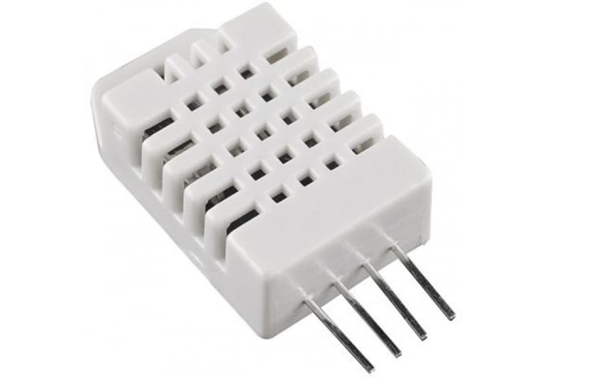
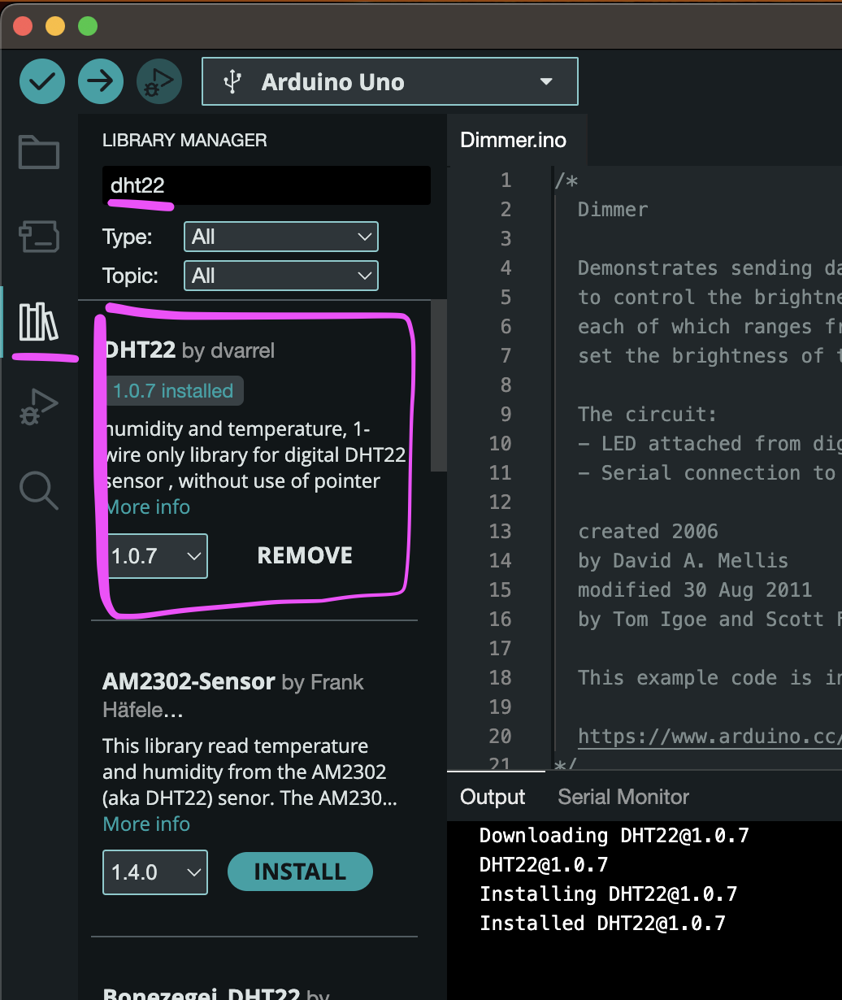

# Arduino Libraries

Let's look at how to install a sensor library.

We'll only do one example, but it works pretty much the same for all others.

## DHT22

The DHT22 (and DHT11) used to be pretty popular temperature and humidity sensors. They're a bit old-fashioned now but still work fine for our purposes.

(If you want a more up-to-date sensor the go-to would be the BME280, including air pressure and altitude!)

## Installing a library

Since Arduino IDE 2.x the library manager sits neatly on the left side of the window.

Just search for DHT22 and install the first result.

## Examples

The Ardunio IDE comes with lots of examples and libraries usually add more.

(Sorry for making you type so much code until now!)

Open

**File > Examples > DHT22 > dht22test**

adjust the pin and flash it!
